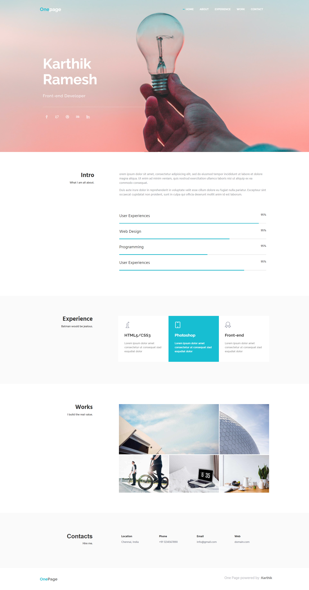

<div align="center">
    <h1>Branding</h1>
</div>


<div align="center">
    <h1>Mobile App Showcase</h1>
</div>


<div align="center">
    <h1>Portfolio</h1>
</div>



<div align="center">
    <h1>Product</h1>
</div>


<div align="center">
    <h1>Restaurant</h1>
</div>


## Run it on your machine

1. Clone the project

   ```sh
   git clone https://github.com/karthik181194/single-page-sites.git
   ```

2. Run the index.html file

